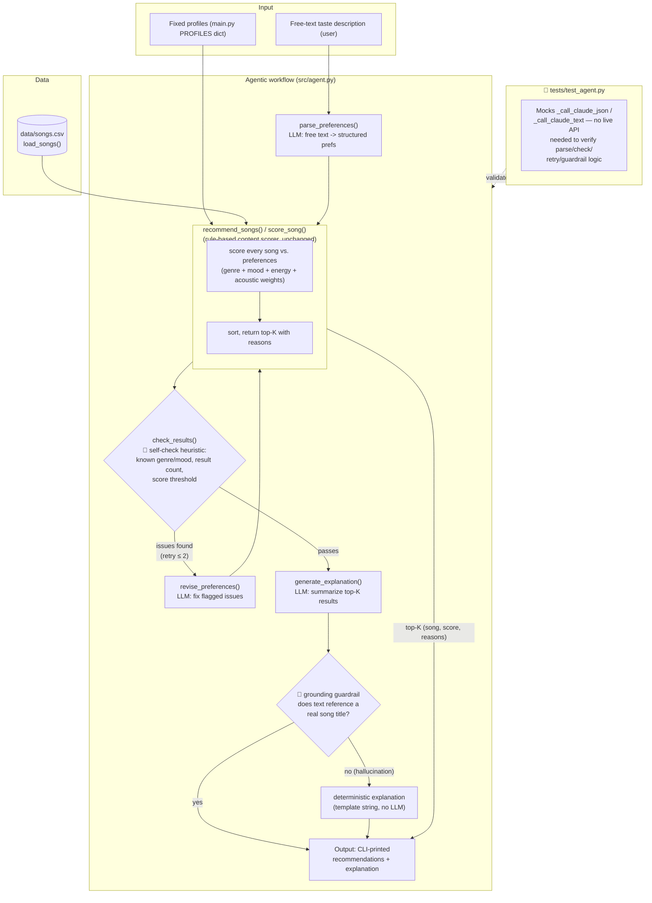

# System Diagram — Music Recommender Simulation

Two entry points share the same scoring core (`src/recommender.py`):

- **Default demo** (`python -m src.main`): fixed profiles → scorer → printed results.
- **Agentic mode** (`python -m src.main --agent "..."`): free text → LLM planner →
  scorer → self-check → retry loop → LLM explanation → grounding guardrail.

Human/testing checkpoints are marked with 🧪 — the self-check heuristic, the
grounding guardrail on the generated explanation, and the mocked unit test
suite that exercises the agent logic without live API calls.

## Component notes

| Component | File | Role |
|---|---|---|
| Scorer | `src/recommender.py` | Deterministic, rule-based content scoring — shared by both entry points, untouched by the agentic layer |
| Planner | `src/agent.py: parse_preferences` | LLM call that turns free text into the scorer's input shape, constrained to genres/moods that exist in the catalog |
| Self-check | `src/agent.py: check_results` | Plain-Python heuristic gate (no LLM) — the first human-designed "tester" in the loop |
| Reviser | `src/agent.py: revise_preferences` | LLM call that retries with the specific issues the self-check found (capped at 2 retries) |
| Explainer | `src/agent.py: generate_explanation` | LLM call that writes prose, but only from the real scored results it's given |
| Grounding guardrail | `src/agent.py: generate_explanation` (title check) | Rejects LLM prose that doesn't mention any of the actual recommended songs, falling back to a deterministic template |
| Test suite | `tests/test_agent.py` | Mocks every LLM call site so the self-check, retry loop, and guardrail are verified without network access |
